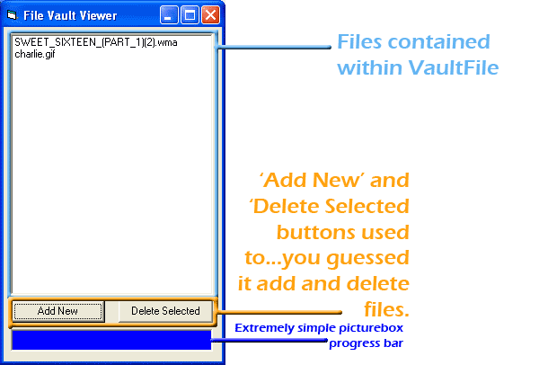

<div align="center">

## FileVault \- Using NTFS Alternate Data Streams


</div>

### Description

UPDATE: Fixed a few minor bugs, and added the ability to import any changes the user may have made to a file back into the vault.

UPDATE: I have updated the code to implement AES encryption (John Korejwa), and Secure Document Shredder(Steppenwolfe). Fixed a major bug that I was unaware of until I did the update. All file types should be launchable now from within the program.

This code demonstrates how to use alternate data streams (ADS) to store programs, files, etc, within another file. There are three projects included in the zip. One is used to View the VaultFiles, one is a blank VaultFile, and the other is used to cleanup tempfiles created when opening a file. Compile all three to the same directory. Launch either FileVaultViewer or VaultFile and the rest should be explained as you go. I have taken extra care to thoroughly comment the code so it should be understandable by coders of any experience level. (Just make sure you understand Alternate Data Streams first.) Feedback would be much appreciated.

Much of the information used to create this was obtained from the site http://www.infosecwriters.com/texts.php?op=display&amp;id=53

Also, I used Ion Alex Ionescu's project (located at http://www.planet-source-code.com/vb/scripts/ShowCode.asp?txtCodeId=47299&amp;lngWId=1) for debugging purposes.
 
### More Info
 


<span>             |<span>
---                |---
**Submitted On**   |2008-03-23 19:47:38
**By**             |[Kevin M Matthews](https://github.com/Planet-Source-Code/PSCIndex/blob/master/ByAuthor/kevin-m-matthews.md)
**Level**          |Advanced
**User Rating**    |5.0 (25 globes from 5 users)
**Compatibility**  |VB 6\.0
**Category**       |[Files/ File Controls/ Input/ Output](https://github.com/Planet-Source-Code/PSCIndex/blob/master/ByCategory/files-file-controls-input-output__1-3.md)
**World**          |[Visual Basic](https://github.com/Planet-Source-Code/PSCIndex/blob/master/ByWorld/visual-basic.md)
**Archive File**   |[FileVault\_2107143242008\.zip](https://github.com/Planet-Source-Code/kevin-m-matthews-filevault-using-ntfs-alternate-data-streams__1-70251/archive/master.zip)

### API Declarations

```
'See Code
```


